# SampleApp

A Sample Flutter front-end development project as a beginner.

## About

This project is a starting point for a my Flutter application development.
In here, I have developed the front-end of a application using only the flutter basic widgets and in-built functions.

If you want to contribute to this projrct, you can send a pull request.

## Here are some of the screenshots of this UI

## Welcome Page
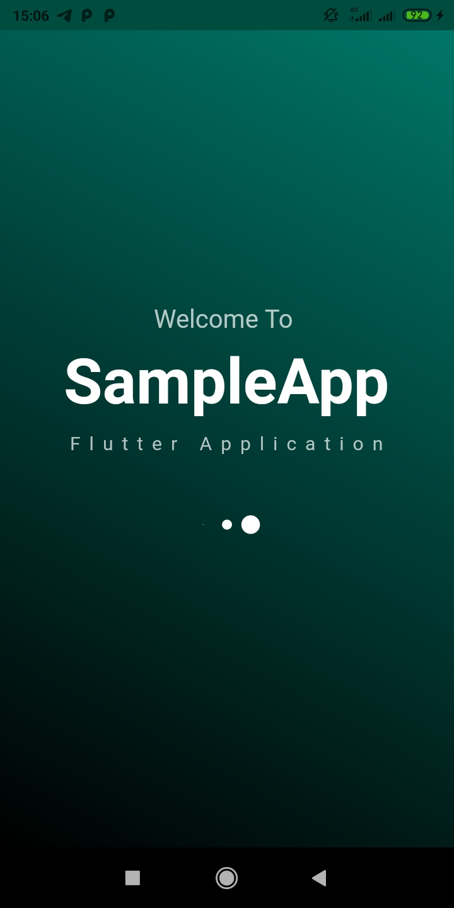

## Stories Page
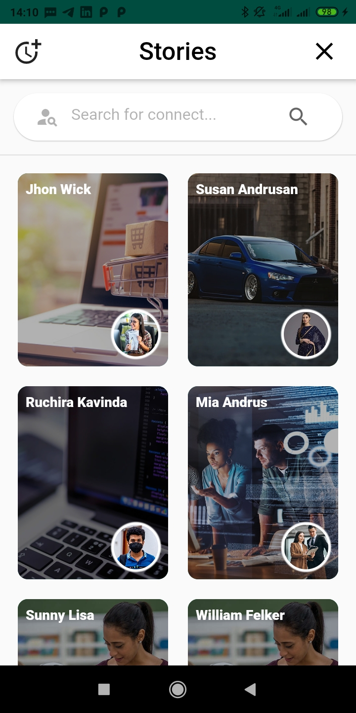

## Sign-In Page
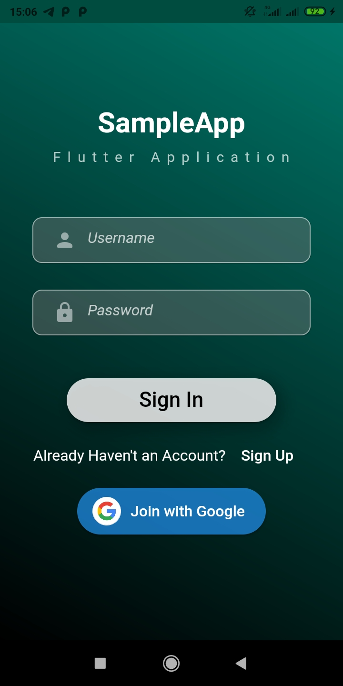

## Sign-Up Page
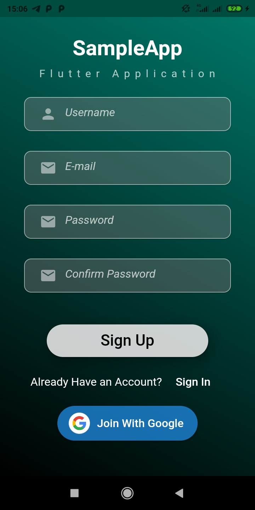

## Home Page
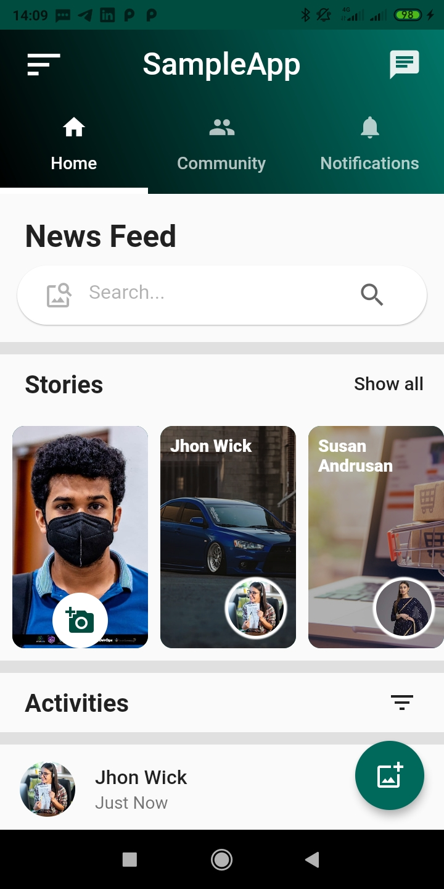

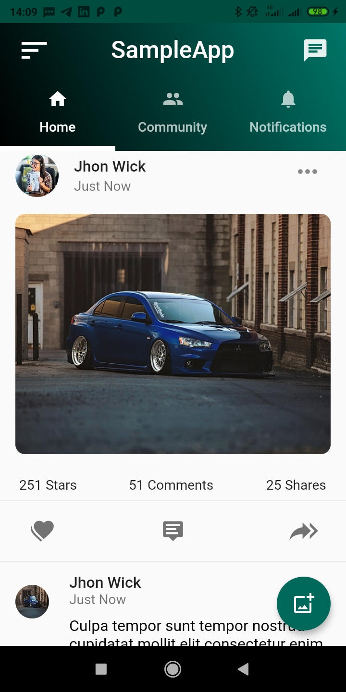

## Community Page
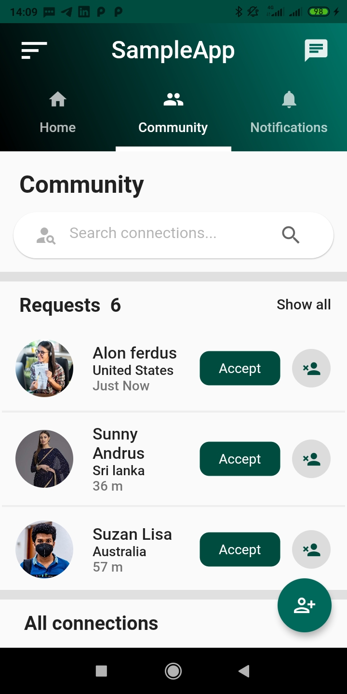

## Fine friends Page
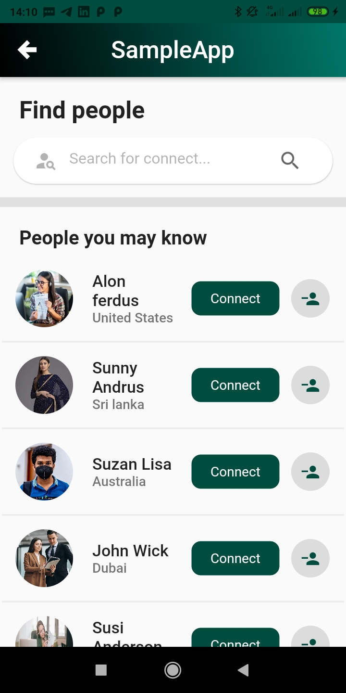

## Notifications Page
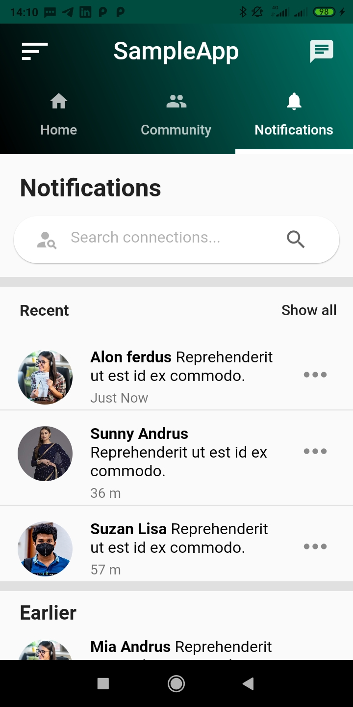

## Messages Page
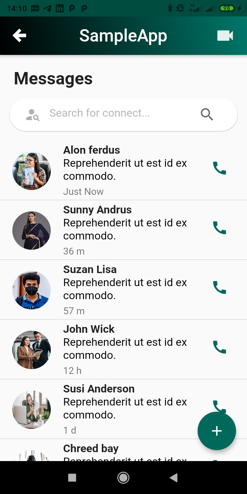

## Drawer
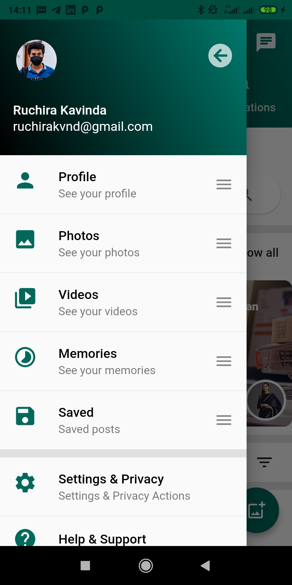

## Profile Page
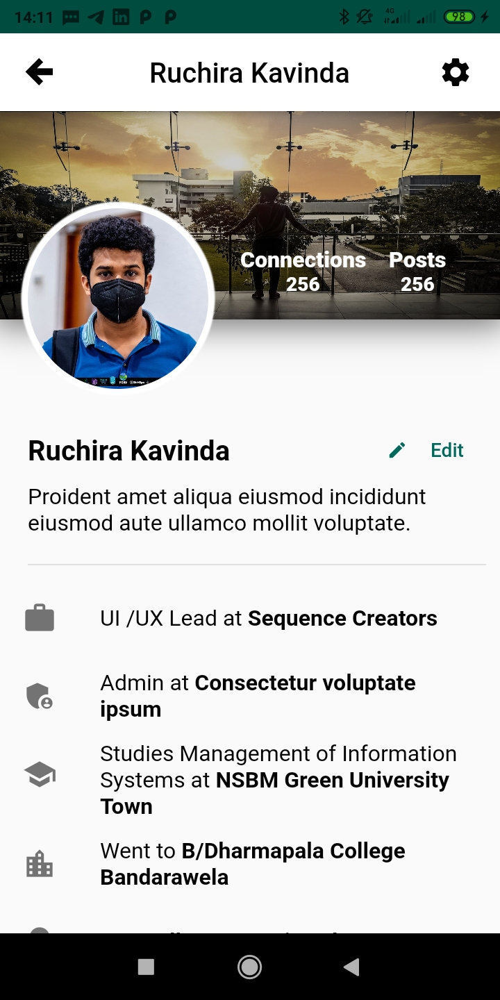

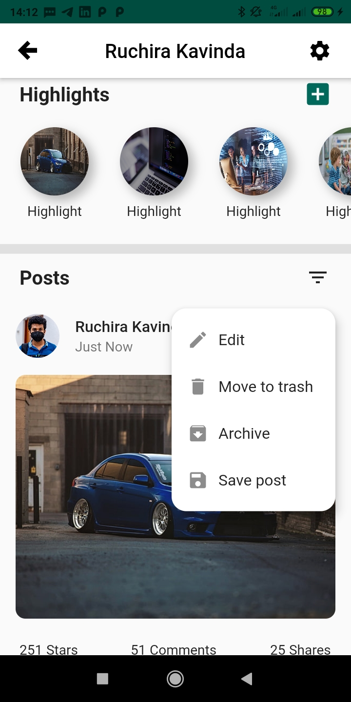

## A few resources to if get you started your first Flutter project:

- [Lab: Write your first Flutter app](https://flutter.dev/docs/get-started/codelab)
- [Cookbook: Useful Flutter samples](https://flutter.dev/docs/cookbook)

For help getting started with Flutter, view 
[online documentation](https://flutter.dev/docs), which offers tutorials,
samples, guidance on mobile development, and a full API reference.
